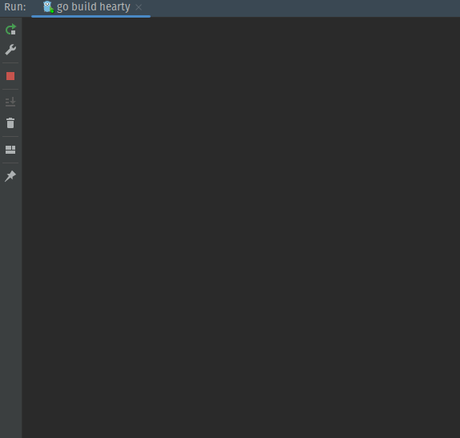

# Hearty

Draw a heart with Golang using `charmbracelet/bubbletea`.



## Instructions

- Make sure that `go`'s version is `>= 1.18`
- Clone the repository
- Run `main.go`

  ```
  go run main.go
  ```

- Press right arrow button to make the heart grows
